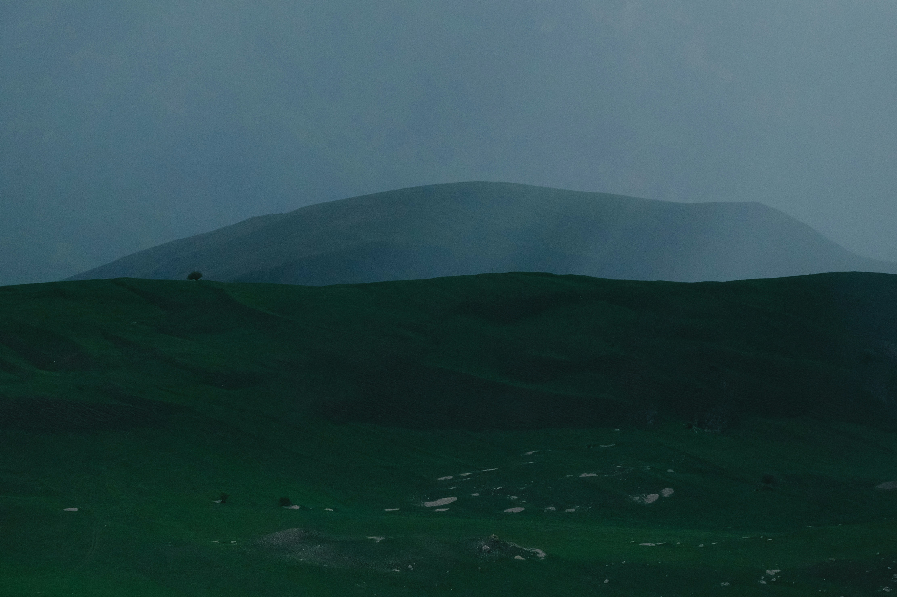

git lfs is required to clone this repo

first clone it like normal:
```bash
git clone https://github.com/staticSomnia/wallpapers
```
cd into the directory then run
```bash
git lfs install
```
```bash
git lfs track *
git lfs track animated/*
```
```bash
git lfs fetch
```
```bash
git lfs checkout
```





